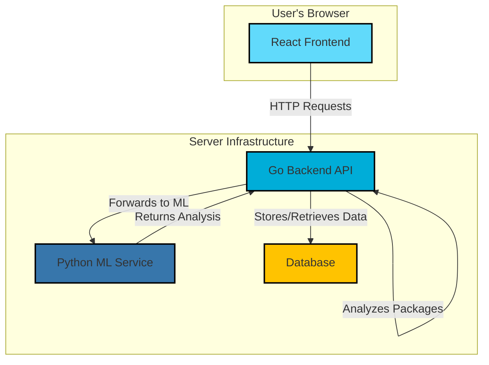

# Typosentinel Codebase Overview

This document provides a comprehensive overview of the Typosentinel codebase, detailing its architecture, components, and core functionalities.

## Project Architecture

The system is composed of three main services orchestrated by `docker-compose.yml`:

1.  **Backend Server (Go):** The core API and business logic.
2.  **ML Service (Python):** Provides machine learning models for advanced threat detection.
3.  **Frontend (React):** A web-based dashboard for users to interact with the system.



---

## 1. Backend (Go)

The backend is the central nervous system of the application, handling API requests, orchestrating scans, and managing data.

### Entrypoint (`main.go`)

The application starts here. It initializes the command-line interface using the `cobra` library.

```go
package main

import "github.com/typosentinel/typosentinel/cmd"

func main() {
	cmd.Execute()
}
```

### Command-Line Interface (`cmd/root.go` and `cmd/scan.go`)

The application uses the `cobra` library to manage commands. The root command sets up configuration and global flags, while the `scan` command contains the core logic for scanning packages.

**`cmd/root.go`:**
```go
// rootCmd represents the base command when called without any subcommands
var rootCmd = &cobra.Command{
	Use:   "typosentinel",
	Short: "Advanced typosquatting detection and package security scanner",
	Long: `TypoSentinel is a comprehensive security tool designed to detect typosquatting
attacks and malicious packages across multiple package registries.`,
}

// Execute adds all child commands to the root command and sets flags appropriately.
func Execute() {
	err := rootCmd.Execute()
	if err != nil {
		os.Exit(1)
	}
}
```

**`cmd/scan.go`:**
This file defines the `scan` command, which orchestrates the different analysis engines.

```go
// scanCmd represents the scan command
var scanCmd = &cobra.Command{
	Use:   "scan [package-name]",
	Short: "Scan a package for typosquatting and security issues",
	Long: `Scan analyzes a package using multiple detection engines to identify
typosquatting attempts, malicious code, and security vulnerabilities.`,
	Args: cobra.MinimumNArgs(1),
	RunE: runScan,
}

// runScan is the main function for the scan command.
func runScan(cmd *cobra.Command, args []string) error {
	// ... (load configuration, create scanner)

	// Perform scan
	result, err := scanner.Scan(ctx, pkg)
	if err != nil {
		return fmt.Errorf("scan failed: %w", err)
	}

	// Output results
	if err := outputResults(result); err != nil {
		return fmt.Errorf("failed to output results: %w", err)
	}

	return nil
}

// Scan performs a comprehensive scan of the package.
func (s *Scanner) Scan(ctx context.Context, pkg *types.Package) (*ScanResult, error) {
	// ... (run static, dynamic, ML, and provenance analysis)

	// Calculate overall risk and generate recommendations
	result.OverallRisk, result.RiskScore = s.calculateOverallRisk(result)
	result.Recommendations = s.generateRecommendations(result)

	// Generate summary
	result.Summary = s.generateSummary(result, enginesUsed, time.Since(startTime))

	return result, nil
}
```

---

## 2. Machine Learning Service (Python)

The ML service provides advanced detection capabilities that are too complex for traditional static analysis.

### API Server (`ml/service/api_server.py`)

A FastAPI server exposes the ML models through a REST API.

```python
# Initialize FastAPI app
app = FastAPI(
    title="TypoSentinel ML API",
    description="Machine Learning API for TypoSentinel package security analysis",
    version="1.0.0",
)

# Startup event to load models
@app.on_event("startup")
async def startup_event():
    """Initialize ML models on startup."""
    global similarity_model, malicious_classifier
    
    logger.info("Loading semantic similarity model...")
    similarity_model = SemanticSimilarityModel()
    
    logger.info("Loading malicious package classifier...")
    malicious_classifier = MaliciousPackageClassifier()

# Similarity endpoint
@app.post("/similarity", response_model=SimilarityResponse)
async def find_similar_packages(request: SimilarityRequest, api_key: str = Depends(verify_api_key)):
    """Find packages similar to the given package name."""
    # ...
    similar_packages = similarity_model.find_similar(
        package_name=request.package_name,
        top_k=request.top_k,
        threshold=request.threshold,
    )
    # ...

# Malicious detection endpoint
@app.post("/malicious", response_model=MaliciousResponse)
async def check_malicious_package(request: MaliciousRequest, api_key: str = Depends(verify_api_key)):
    """Check if a package is malicious."""
    # ...
    result = malicious_classifier.predict(package_features)
    # ...
```

---

## 3. Frontend (React)

The frontend is a modern single-page application (SPA) that provides a user-friendly interface for the Typosentinel service.

### Main Application (`web/src/App.tsx`)

The root component sets up routing and theming for the application.

```typescript
const App: React.FC = () => {
  return (
    <ThemeProvider theme={theme}>
      <CssBaseline />
      <AuthProvider>
        <SocketProvider>
          <Box sx={{ minHeight: '100vh', bgcolor: 'background.default' }}>
            <AppContent />
          </Box>
        </SocketProvider>
      </AuthProvider>
    </ThemeProvider>
  );
};

const AppContent: React.FC = () => {
  const { user, loading } = useAuth();

  if (loading) {
    return <LoadingSpinner />;
  }

  if (!user) {
    return <Login />;
  }

  return (
    <Router>
      <Routes>
        {/* Enterprise Management Routes */}
        <Route path="/enterprise" element={<EnterpriseLayout />}>
          <Route index element={<Navigate to="/enterprise/dashboard" replace />} />
          <Route path="dashboard" element={<ExecutiveDashboard />} />
          {/* ... other routes */}
        </Route>

        {/* ... other routes */}
      </Routes>
    </Router>
  );
};
```

### Executive Dashboard (`web/src/pages/enterprise/ExecutiveDashboard.tsx`)

This component displays the main dashboard with key metrics, charts, and recent findings.

```typescript
const ExecutiveDashboard: React.FC = () => {
  const [metrics, setMetrics] = useState<DashboardMetrics | null>(null);
  const [loading, setLoading] = useState(true);

  useEffect(() => {
    loadDashboardData();
    // ...
  }, []);

  const loadDashboardData = async () => {
    // ... (fetch data from API)
  };

  if (loading || !metrics) {
    return <LinearProgress />;
  }

  return (
    <Box sx={{ p: 3 }}>
      {/* Key Metrics Cards */}
      <Grid container spacing={3} sx={{ mb: 4 }}>
        {/* ... */}
      </Grid>

      {/* Charts and Analytics */}
      <Grid container spacing={3} sx={{ mb: 4 }}>
        <Grid item xs={12} md={8}>
          <Card>
            <CardContent>
              <Typography variant="h6" gutterBottom>
                Security Trends (Last 7 Days)
              </Typography>
              <ResponsiveContainer width="100%" height={300}>
                <LineChart data={metrics.trendsData}>
                  {/* ... */}
                </LineChart>
              </ResponsiveContainer>
            </CardContent>
          </Card>
        </Grid>
        {/* ... */}
      </Grid>

      {/* Recent Findings and Top Risky Packages */}
      <Grid container spacing={3}>
        {/* ... */}
      </Grid>
    </Box>
  );
};