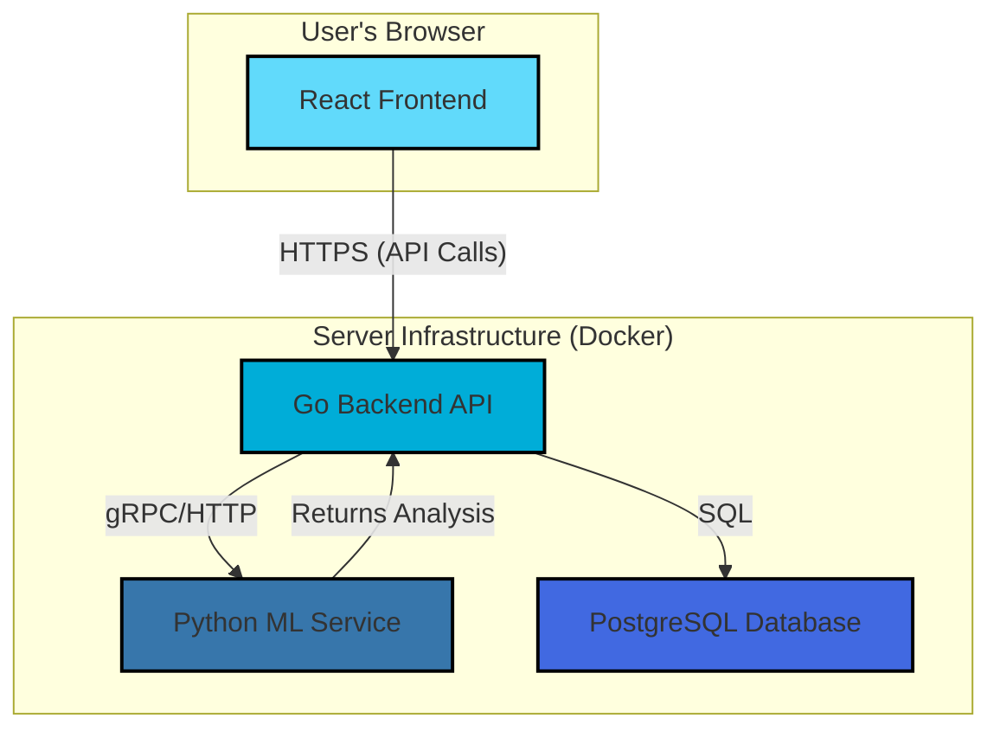

# TypoSentinel: Project Guide for Developers and Architects

This guide provides essential information for architects designing and developers working on the TypoSentinel project.

---

## 1. For the System Architect

This section covers the high-level architecture, component design, and key strategic decisions for the TypoSentinel platform.

### 1.1. System Architecture Overview

TypoSentinel is a distributed, multi-component system designed for scalability and modularity. It consists of three core services orchestrated via Docker Compose:

1.  **Go Backend (`api-server`):** The central API and orchestration layer. It handles all incoming requests, manages the scanning workflow, and interacts with the database and ML service.
2.  **Python ML Service (`ml-service`):** A dedicated service that hosts machine learning models for advanced threat detection (semantic similarity, malicious code classification).
3.  **React Frontend (`web-client`):** A single-page application (SPA) that provides the user interface and dashboard for interacting with the system.

**Architectural Diagram:**



### 1.2. Key Design Principles

*   **Microservices:** The separation of the Go backend and Python ML service allows for independent development, scaling, and deployment.
*   **Stateless Services:** The backend and ML services are designed to be stateless where possible, relying on the database for persistent state. This simplifies scaling horizontally.
*   **Asynchronous Processing:** For long-running tasks like package scanning, a job queue system (e.g., Redis/RabbitMQ) should be considered to decouple the initial request from the processing work.
*   **Configuration-Driven:** The system is heavily driven by YAML configuration files, allowing for easy adjustments to analysis engines, feature flags, and service endpoints without code changes.

### 1.3. Data Flow: Package Scan

1.  **Request:** A scan request is initiated from the Frontend, CLI, or VS Code Extension, hitting the Go Backend API.
2.  **Orchestration:** The Go Backend's `scanner` module begins the analysis.
3.  **Initial Analysis:** Static analysis, reputation checks, and homoglyph detection are performed directly within the Go service.
4.  **ML Augmentation:** If the configuration requires it, the Go service sends the package metadata and code features to the Python ML Service for deeper analysis.
5.  **Response Aggregation:** The Go Backend aggregates the results from all analysis engines.
6.  **Risk Calculation:** A final risk score is calculated based on a weighted average of the different engine outputs.
7.  **Storage:** The scan results are stored in the PostgreSQL database.
8.  **Notification:** The Frontend is notified of the completed scan via WebSockets.

### 1.4. Scalability and Deployment

*   **Containerization:** The entire system is containerized using Docker and orchestrated with `docker-compose.yml` for development and `kubernetes` manifests for production.
*   **Horizontal Scaling:** The Go Backend and Python ML Service can be scaled horizontally by increasing the number of container replicas. A load balancer would be required in front of them.
*   **Database:** The PostgreSQL database can be scaled using read replicas or by migrating to a managed cloud database service (e.g., AWS RDS, Google Cloud SQL).

---

## 2. For the Developer

This section provides practical instructions for setting up the development environment, running the project, and contributing to the codebase.

### 2.1. Development Environment Setup

**Prerequisites:**
*   Go (version 1.18+)
*   Python (version 3.9+)
*   Node.js (version 16+) and `npm` or `yarn`
*   Docker and Docker Compose

**Setup Steps:**

1.  **Clone the repository:**
    ```bash
    git clone <repository-url>
    cd typosentinel
    ```

2.  **Backend Dependencies:**
    ```bash
    go mod tidy
    ```

3.  **Frontend Dependencies:**
    ```bash
    cd web
    npm install
    cd ..
    ```

4.  **ML Service Dependencies:**
    ```bash
    cd ml
    pip install -r requirements.txt
    cd ..
    ```

5.  **Environment Variables:**
    Create a `.env` file in the root directory and populate it with the necessary environment variables, using `config.yaml` as a reference.

### 2.2. Running the Project

The easiest way to run the entire stack is using Docker Compose:

```bash
docker-compose up --build
```

This will start the Go backend, Python ML service, and the database.

To run services individually for development:

*   **Run Go Backend:**
    ```bash
    go run main.go server
    ```

*   **Run Python ML Service:**
    ```bash
    cd ml
    python service/api_server.py --reload
    ```

*   **Run React Frontend:**
    ```bash
    cd web
    npm run dev
    ```

### 2.3. Codebase Structure

*   `cmd/`: Main entrypoints for the Go application (server, scanner CLI).
*   `internal/`: Core Go application logic. This is where most of the backend code lives.
    *   `internal/scanner/`: The main package scanning orchestration logic.
    *   `internal/detector/`: Individual detection engines (homoglyph, reputation).
    *   `internal/static/`, `internal/dynamic/`: Static and dynamic analysis engines.
*   `ml/`: The Python ML service.
    *   `ml/service/`: The FastAPI server.
    *   `ml/models/`: The machine learning models.
    *   `ml/training/`: Scripts for training the models.
*   `web/`: The React frontend application.
    *   `web/src/pages/`: Top-level page components.
    *   `web/src/components/`: Reusable UI components.
    *   `web/src/services/`: API client logic for communicating with the backend.
*   `vscode-extension/`: The source code for the VS Code extension.

### 2.4. Running Tests

*   **Go Tests:**
    ```bash
    go test ./...
    ```

*   **Python Tests:**
    ```bash
    cd ml
    pytest
    ```

*   **Frontend Tests:**
    ```bash
    cd web
    npm test
    ```

### 2.5. Contribution Guidelines

1.  **Branching:** Create a new feature branch from `main` for every new feature or bug fix (e.g., `feature/new-detector` or `fix/login-bug`).
2.  **Coding Style:**
    *   **Go:** Follow standard Go formatting (`gofmt`).
    *   **Python:** Follow PEP 8 and use `black` for formatting.
    *   **TypeScript/React:** Follow the existing coding style and use Prettier for formatting.
3.  **Commit Messages:** Use conventional commit messages (e.g., `feat: add new detector for rust packages`).
4.  **Pull Requests:** Open a pull request against the `main` branch. Ensure all tests are passing and provide a clear description of the changes.