# Typosentinel

[](https://golang.org)
[](LICENSE)
[](https://github.com/Alivanroy/Typosentinel/actions/workflows/ci.yml)
[](https://goreportcard.com/report/github.com/Alivanroy/Typosentinel)
[](https://pkg.go.dev/github.com/Alivanroy/Typosentinel)
[](https://hub.docker.com/r/vanali/typosentinel)

> **The only open-source tool that detects SolarWinds-style build compromises, Shai-Hulud GitHub Actions backdoors, and CI-aware malware without Docker.**

**Typosentinel** is a next-generation supply chain security platform that goes beyond basic typosquatting detection. It provides comprehensive protection against sophisticated attacks including build-time compromises, CI/CD infrastructure abuse, and runtime exfiltration patterns.

⭐ **If you find Typosentinel useful, please star this repository to show your support!** ⭐

## 🎯 Why Typosentinel?

Traditional security scanners miss advanced threats. Typosentinel detects:

✅ **Build Integrity Attacks** (SolarWinds/SUNBURST)
- Trojanized binaries in build outputs
- Time-delayed malware activation (dormancy detection)
- Unsigned or suspicious digital signatures

✅ **CI/CD Infrastructure Abuse** (Shai-Hulud)
- Malicious GitHub Actions workflows
- Self-hosted runner backdoors
- Code injection vulnerabilities (`${{ github.event.discussion.body }}`)
- GitLab CI misconfigurations

✅ **Runtime Exfiltration** (No Docker Required)
- GitHub/GitLab API calls from install scripts
- Environment-aware malware (CI-targeted attacks)
- Periodic C2 communication patterns

✅ **Traditional Typosquatting**
- npm, PyPI, Go, Maven, Cargo, Ruby, PHP, NuGet
- Edit distance, homoglyph, semantic similarity
- Dependency confusion attacks

## 📊 Project Status

**Current Version**: v2.0.0 (Production Ready)

**Performance**: < 10 seconds per package | **Detection Rate**: 80%+ | **Docker**: Not Required


## �️ Architecture

### System Overview

```mermaid
flowchart TB
    subgraph Users["👥 Users & Integrations"]
        CLI["🖥️ CLI"]
        API["🌐 REST API"]
        CICD["⚙️ CI/CD Pipelines"]
        Webhooks["🔗 Webhooks"]
    end

    subgraph Core["🔷 TypoSentinel Core"]
        Scanner["📦 Scanner Engine"]
        Detector["🔍 Threat Detector"]
        ML["🧠 ML Engine"]
        Policy["📋 Policy Engine"]
    end

    subgraph Registries["📚 Package Registries"]
        NPM["npm"]
        PyPI["PyPI"]
        Go["Go Modules"]
        Maven["Maven"]
        NuGet["NuGet"]
        More["..."]
    end

    subgraph Storage["💾 Storage & Cache"]
        Redis["Redis Cache"]
        DB["Vulnerability DB"]
        Config["Configuration"]
    end

    subgraph Output["📊 Output & Reporting"]
        JSON["JSON"]
        SARIF["SARIF"]
        SBOM["SBOM"]
        Dashboard["Dashboard"]
    end

    CLI --> Scanner
    API --> Scanner
    CICD --> API
    Webhooks --> API

    Scanner --> Detector
    Scanner --> ML
    Scanner --> Policy
    
    Detector --> Registries
    ML --> Registries
    
    Scanner --> Storage
    Detector --> Storage
    
    Scanner --> Output
    Policy --> Output

    style Core fill:#e1f5fe
    style Users fill:#f3e5f5
    style Registries fill:#e8f5e9
    style Storage fill:#fff3e0
    style Output fill:#fce4ec
```



### Core Components


### Detection Pipeline


For detailed architecture documentation, see [ARCHITECTURE.md](docs/ARCHITECTURE.md).

## �🎯 Production Readiness Matrix

| Component | Status | Recommended For | Notes |
|-----------|--------|-----------------|-------|
| **CLI Scanner** | ✅ Production Ready | All users | Core functionality stable |
| **Typosquatting Detection** | ✅ Production Ready | All users | Tested with real-world packages |
| **SBOM Generation** | ✅ Production Ready | CI/CD pipelines | SPDX & CycloneDX compliant |
| **Multi-language Support** | ✅ Production Ready | npm, PyPI, Go, Maven | Other registries in beta |
| **Supply Chain Firewall** | 🚧 Planned | Testing/staging | Coming in v2.1 |
| **Advanced Threat Detection** | ✅ Production Ready | All users | Build/CI/Runtime analysis active |
| **REST API** | 🚧 Planned | Internal tools | Coming in v2.1 |
| **DIRT/RUNT/GTR Algorithms** | ✅ Production Ready | All users | Validated in v2.0.0 |
| **ML Detection** | 🔬 Experimental | Not recommended | Requires model training |
| **Docker Deployment** | ✅ Production Ready | CLI usage | Containerized CLI available |

**Legend**:
- ✅ Production Ready: Tested, stable, ready for critical use
- 🚧 Beta: Functional, needs more testing/hardening
- 🔬 Experimental: Proof of concept, not for production

## 🚀 Features

### Supply Chain Firewall Features 🚧
- **Active Blocking** 🚧: Real-time package interception and policy-based blocking
- **Business-Aware Risk Assessment** ✅: Asset criticality scoring (CRITICAL/INTERNAL/PUBLIC) with intelligent multipliers
- **Policy Engine** 🚧: 5 default security policies with customizable rules and thresholds
- **CI/CD Integration** ✅: GitHub Actions integration for build-time package blocking
- **Multi-Language Support** ✅: npm, PyPI, Go modules, Maven, NuGet, and more package managers

### Advanced Detection & Analysis
- **DIRT Algorithm** 🚧: Business-aware Dependency Impact Risk Traversal with asset criticality scoring
- **Campaign Intelligence** 🔬: Group related malicious packages into coordinated campaigns
- **Behavioral Analysis** 🔬: Dynamic sandbox analysis with filesystem and network monitoring
- **Threat Intelligence** 🚧: Real-time integration with multiple threat intelligence feeds
- **Enhanced Detection** ✅: Advanced algorithms for sophisticated typosquatting and supply chain attacks

### 🛡️ Advanced Threat Detection (Unique Capabilities)

Typosentinel is the **only open-source tool** that detects these sophisticated supply chain attacks:

#### 1. Build Integrity & SolarWinds-Style Attacks
- **Dormancy Detection**: Identifies malware that sleeps before activating (e.g., `setTimeout` > 7 days, date-based triggers).
- **Build Artifact Scanning**: Detects trojanized binaries (PE, ELF, Mach-O) injected into build outputs.
- **Signature Verification**: Validates Authenticode and codesign signatures to detect tampered binaries.

#### 2. CI/CD Infrastructure & Shai-Hulud Attacks
- **Workflow Injection**: Detects malicious code injection patterns in GitHub Actions (e.g., `${{ github.event.discussion.body }}`).
- **Runner Backdoors**: Flags self-hosted runner registrations that can be abused for persistence.
- **C2 Channels**: Identifies workflows triggered by Discussions/Issues used for Command & Control.

#### 3. Runtime Behavior Analysis (No Docker Required)
- **Static Network Analysis**: Scans code for exfiltration patterns (GitHub/GitLab API calls, environment variable theft).
- **Environment-Aware Malware**: Detects malware that targets specific CI environments (e.g., checking `process.env.CI` multiple times).
- **Beacon Detection**: Identifies periodic network activity patterns indicative of C2 beacons.

### 📦 Core Features
- **Typosquatting Detection**: Advanced algorithms (RUNT, DIRT, GTR) to find malicious package mimics.
- **Install Script Analysis**: Heuristic detection of dangerous commands (`curl | bash`, `rm -rf`) in install scripts.
- **Dependency Confusion**: Identifies internal packages that might be claimed publicly.
- **Secret Scanning**: Finds hardcoded API keys, tokens, and credentials.


### Integration & Deployment
- **SBOM Generation** ✅: SPDX and CycloneDX software bill of materials support
- **Docker Deployment** ✅: Complete containerized CLI deployment
- **Multi-format Output** ✅: JSON, YAML, SARIF, table, and terminal output

### Performance & Reliability
- **Real-time Processing** ✅: Sub-second response times
- **Policy Reporting** ✅: Detailed policy violation reports


## 📦 Installation

### Binary Releases

Download the latest release from [GitHub Releases](https://github.com/Alivanroy/Typosentinel/releases):

```bash
# Linux
wget https://github.com/Alivanroy/Typosentinel/releases/latest/download/typosentinel-linux-amd64
chmod +x typosentinel-linux-amd64
sudo mv typosentinel-linux-amd64 /usr/local/bin/typosentinel

# macOS
wget https://github.com/Alivanroy/Typosentinel/releases/latest/download/typosentinel-darwin-amd64
chmod +x typosentinel-darwin-amd64
sudo mv typosentinel-darwin-amd64 /usr/local/bin/typosentinel

# Windows
# Download typosentinel-windows-amd64.exe and add to PATH
```

### Windows Notes

**Recommended Usage on Windows**:
```bash
# ✅ Scan specific files (reliable)
.\typosentinel.exe scan package.json --output json

# ✅ Scan specific directories (reliable)
.\typosentinel.exe scan .\src --output table

# ⚠️ Scan current directory (may be intermittent)
.\typosentinel.exe scan . --output json
```

**Known Windows Issues**:
- Directory scanning may be intermittent in large projects
- Workaround: Always specify the exact directory or manifest file to scan

### From Source

```bash
git clone https://github.com/Alivanroy/Typosentinel.git
cd Typosentinel
make build
# Binary will be created as ./typosentinel
```

### Docker Deployment

```bash
# One-line CLI scan using Docker (mounts current directory)
docker build -t typosentinel . && docker run --rm -v "$PWD:/scan" typosentinel ./typosentinel scan /scan --output json --supply-chain --advanced
```

CI publish to Docker Hub:
- Add repository secrets: `DOCKERHUB_USERNAME`, `DOCKERHUB_TOKEN`
- Trigger “Docker Hub Publish” workflow (Actions) with `image_name` (e.g., `yourname/typosentinel`) and `tag` (e.g., `v1.0.3`)
- On tag pushes (`v*.*.*`), images are built and pushed as `latest` and `<tag>`.


## 🔧 Quick Start

### Recommended First Steps

1. **Scan a known typosquatting example**:
```bash
# Create test project
mkdir test-scan && cd test-scan
echo '{"dependencies": {"expres": "1.0.0"}}' > package.json

# Scan (should detect "expres" as typosquat of "express")
typosentinel scan . --output table
```

**Expected Output**: Should identify "expres" as a typosquatting threat

2. **Scan your real project** (recommended approach):
```bash
# Scan specific manifest file
typosentinel scan path/to/package.json --output json

# Or scan project directory
typosentinel scan path/to/project --output table
```

3. **Generate SBOM**:
```bash
typosentinel scan . --sbom-format spdx --sbom-output sbom.json
```

# Scan with enhanced detection
typosentinel scan --enhanced /path/to/project

# Scan specific package managers
typosentinel scan --package-manager npm /path/to/project
typosentinel scan --package-manager pypi /path/to/project

# Output results to file
typosentinel scan --output report.json /path/to/project

# Enable verbose logging
typosentinel scan --verbose /path/to/project
```

### Advanced Scanning

```bash
# Supply chain security scan
typosentinel supply-chain scan-advanced /path/to/project \
  --build-integrity \
  --threat-intel \
  --risk-threshold high

# Organization scanning
typosentinel scan-org github \
  --org company-name \
  --token $GITHUB_TOKEN \
  --max-repos 100

# SBOM generation
typosentinel scan /path/to/project \
  --sbom-format spdx \
  --sbom-output project-sbom.spdx.json
```

## 🌐 Web Interface & Server

### Starting the Web Server

```bash
# Start the server with default settings
typosentinel server

# Start with custom configuration
typosentinel server --port 8080 --host 0.0.0.0

# Development mode with enhanced logging
typosentinel server --dev --verbose
```

### API Authentication

Authentication is controlled via environment variables:

- `API_AUTH_ENABLED`: set to `true` or `1` to require a bearer token
- `API_KEYS`: comma‑separated list of allowed API keys (e.g., `key1,key2`)

Example curl with bearer token:

```bash
curl -s -X POST http://localhost:8080/v1/analyze \
  -H "Authorization: Bearer key1" \
  -H "Content-Type: application/json" \
  -d '{"package_name":"express","registry":"npm"}'
```

Docker run with auth enabled:

```bash
docker build -t typosentinel-api . && \
docker run --rm -p 8080:8080 \
  -e API_AUTH_ENABLED=true \
  -e API_KEYS=key1,key2 \
  typosentinel-api
```

Note: demo‑only endpoints (`/api/v1/vulnerabilities`, `/api/v1/dashboard/*`) return `501 Not Implemented`.

## 📜 Governance
- Contributing: see `CONTRIBUTING.md`
- Code of Conduct: see `CODE_OF_CONDUCT.md`
- Security Policy: see `SECURITY.md`

## 🔎 API Docs
- OpenAPI JSON: `/openapi.json`
- Interactive docs: `/docs`

### Firewall Dashboard Features

- **🛡️ Firewall Status**: Real-time supply chain firewall monitoring with live activity feed
- **📊 Security Metrics**: Policy violations, blocked packages, and threat intelligence
- **🔍 Package Analysis**: Interactive package scanning with business-aware risk assessment
- **📈 Activity Feed**: Live stream of security events and policy enforcements
- **⚙️ Policy Management**: Web-based configuration of security policies and thresholds
- **📋 Reports**: Downloadable security reports with business impact analysis

### API Endpoints

```bash
# Health and status
GET /health
GET /v1/status
GET /v1/stats

# Analyze a single package (demo mode)
POST /v1/analyze
{
  "package_name": "express",
  "registry": "npm"
}

# Batch analysis (demo mode)
POST /v1/analyze/batch
{
  "packages": [
    {"package_name": "express", "registry": "npm"},
    {"package_name": "test-package", "registry": "npm"}
  ]
}

# Vulnerabilities (mock data)
GET /api/v1/vulnerabilities?severity=critical

# Dashboard metrics (mock data)
GET /api/v1/dashboard/metrics
GET /api/v1/dashboard/performance
```

### Current Status & Honest Metrics

- API server endpoints validated end-to-end with automated tests
- Legitimate packages (e.g., `express`) return `risk_level: 0` and `risk_score: 0.0`
- Suspicious names (e.g., `test-package`, very short, numeric-included) produce appropriate threats/warnings
- Webhook endpoints scaffolded; some provider routes operate in demo mode
- Unit test coverage highlights:
  - `pkg/types`: 100%
  - `internal/supplychain`: ~54%
  - Other modules vary; several integration tests are skipped in demo mode
- API tests (tag `api`) pass; batch and rate limiting behavior validated
- Demo mode is enabled for several endpoints with mock data responses

## 🔍 Detection Methods

### Core Detection Algorithms

#### 1. String Similarity Analysis
- **Levenshtein Distance**: Character-level edit distance calculation
- **Jaro-Winkler Similarity**: Weighted string matching with prefix bias
- **Longest Common Subsequence (LCS)**: Sequence-based similarity detection
- **Cosine Similarity**: Vector-based text similarity
- **N-Gram Analysis**: Character and word n-gram comparison

#### 2. Visual Similarity Detection
- **Unicode Homoglyph Detection**: Visually similar character identification
- **Character Substitution Patterns**: Common typo pattern recognition
- **Script Mixing Detection**: Multiple Unicode script usage
- **Confusable Character Mapping**: International character confusion

#### 3. Behavioral Analysis
- **Dynamic Sandbox Analysis**: Runtime behavior monitoring in isolated containers
- **Filesystem Activity**: File creation, modification, and access patterns
- **Network Communication**: Outbound connections and data exfiltration attempts
- **Process Behavior**: Suspicious process creation and execution patterns
- **Code Execution**: Eval, shell execution, and crypto mining detection

#### 4. Campaign Intelligence
- **Package Similarity**: Code and metadata similarity analysis
- **Author Clustering**: Maintainer identity and behavior patterns
- **Network IOCs**: Shared domains, IPs, and infrastructure
- **Campaign Grouping**: Automatic grouping of related malicious packages

#### 5. Risk Scoring
- **Multi-Factor Assessment**: Vulnerability, behavior, and campaign risk factors
- **Configurable Weights**: Customizable risk factor importance
- **Confidence Scoring**: Reliability assessment of detection results
- **Automatic Recommendations**: Actionable security recommendations

### 📊 Honest Performance Metrics

Measured locally (Windows 11, i7‑12700H, Go 1.23):

- DetectEnhanced: ~246µs/op (mixed cases: expresss/lodahs/recat/axois)
- DetectEnhanced (homoglyphs): ~157µs/op (Cyrillic/Greek/visual substitutions)
- Allocations: 636 allocs/op (DetectEnhanced), 486 allocs/op (homoglyphs)
- Memory: ~40KB/op (DetectEnhanced), ~31KB/op (homoglyphs)

To reproduce: `go test -bench=. -benchmem ./tests/benchmarks/...`

Throughput benchmarks:

- Small project (50 deps): ~6.75ms/run, ~1.13MB alloc, ~14.8k allocs/run
- Medium project (200 deps): ~33.6ms/run, ~4.54MB alloc, ~59.1k allocs/run

Memory profile (typical):

- Base: ~15MB
- Per 100 packages: ~8MB additional
- Peak during enhanced analysis: ~2× base

Validated summary:

| Project size | Time/run | Memory | Allocs/run |
|--------------|----------|--------|------------|
| Small (50)   | ~6.75ms  | ~1.13MB| ~14.8k     |
| Medium (200) | ~33.6ms  | ~4.54MB| ~59.1k     |
| Large (500)  | ~75.3ms  | ~11.3MB| ~147.6k    |

## 🚀 CI/CD Integration

### GitHub Actions Supply Chain Firewall

```yaml
# .github/workflows/supply-chain-firewall.yml
name: Supply Chain Firewall
on: [push, pull_request]

jobs:
  supply-chain-protection:
    runs-on: ubuntu-latest
    steps:
      - uses: actions/checkout@v4
      - name: Supply Chain Firewall
        uses: Alivanroy/Typosentinel/.github/actions/supply-chain-firewall@main
        with:
          policy-config: |
            policies:
              - name: "Block Critical Risk"
                condition: "risk_score >= 0.9"
                action: "BLOCK"
              - name: "Alert Typosquatting"
                condition: "typosquatting_score >= 0.8"
                action: "ALERT"
          asset-criticality: "INTERNAL"
          fail-on-policy-violation: true
```

### GitLab CI Supply Chain Protection

```yaml
# .gitlab-ci.yml
supply_chain_firewall:
  stage: security
  image: alpine:latest
  before_script:
    - apk add --no-cache wget
    - wget -O typosentinel https://github.com/Alivanroy/Typosentinel/releases/latest/download/typosentinel-linux-amd64
    - chmod +x typosentinel
  script:
    - ./typosentinel supply-chain policy-enforce --config policies.yaml --asset-criticality INTERNAL .
  artifacts:
    reports:
      sast: gl-sast-report.json
    expire_in: 1 week
  only:
    - merge_requests
    - main
```

## 📖 Documentation

### Core Documentation
- [User Guide](docs/USER_GUIDE.md) - Supply chain firewall configuration and usage
- [API Documentation](docs/API_DOCUMENTATION.md) - REST API for policy management and enforcement
- [Docker Deployment Guide](DOCKER.md) - Complete containerized firewall deployment

### Advanced Features
- [Supply Chain Policy Engine](internal/supplychain/) - Business-aware policy enforcement system
- [DIRT Algorithm](internal/edge/) - Dependency Impact Risk Traversal with asset criticality
- [Campaign Intelligence](internal/campaign/) - Coordinated threat campaign detection
- [Business-Aware Risk Assessment](internal/edge/dirt.go) - Asset criticality scoring and risk multipliers

### Development & Deployment
- [Contributing Guide](CONTRIBUTING.md) - How to contribute to the project
- [Security Policy](SECURITY.md) - Security vulnerability reporting

## ⚠️ Known Issues

### General
- **Windows Directory Scanning**: `scan .` (current directory) may be intermittent. Use `scan <specific-dir>` or `scan package.json` for reliable results.
- **Detector Initialization**: In rare cases, threat detector may not initialize properly. Logs will show warnings about skipped threat detection.
- **Large Projects**: Projects with 1000+ dependencies may experience slower scan times (optimization in progress)

### Experimental Features
- **Supply Chain Firewall**: Policy enforcement is functional but needs security hardening before trust in critical environments
- **API Authentication**: Currently supports basic auth and API keys. OAuth/JWT planned for future releases
- **Redis Cache**: Requires manual Redis setup. In-memory fallback available but less performant

### Windows-Specific
- Directory scanning of `.` may crash in edge cases (workaround: scan specific directories)
- Some E2E tests may fail on Windows (under investigation)

**Reporting Issues**: Please report bugs via [GitHub Issues](https://github.com/Alivanroy/Typosentinel/issues) with:
- OS and version
- Command run
- Full error output
- Project structure (if applicable)

## 🛠️ Development

### Prerequisites

- Go 1.23 or later
- Make (optional)
- Docker (for containerized development)

### Setup Development Environment

```bash
git clone https://github.com/Alivanroy/Typosentinel.git
cd Typosentinel
make dev-setup
```

### Available Make Targets

```bash
make help                # Show all available targets
make build              # Build the binary
make test               # Run tests
make test-coverage      # Run tests with coverage
make lint               # Run linters
make fmt                # Format code
make clean              # Clean build artifacts
make docker-build       # Build Docker image
```

## 📄 License

This project is licensed under the MIT License - see the [LICENSE](LICENSE) file for details.

## 🔒 Security

For security vulnerabilities, please see our [Security Policy](SECURITY.md).

## 📞 Support

- **Issues**: [GitHub Issues](https://github.com/Alivanroy/Typosentinel/issues)
- **Discussions**: [GitHub Discussions](https://github.com/Alivanroy/Typosentinel/discussions)

## 🙏 Acknowledgments

- Thanks to all contributors who have helped improve this project
- Inspired by the need for better supply chain security
- Built with ❤️ for the open source community

---

**Made with ❤️ by [Alivanroy](https://github.com/Alivanroy)**
### CLI Flags

- `--output {json|sarif|table}`: choose output format (SARIF requires tooling)
- `--supply-chain`: enable supply chain risk analysis
- `--advanced`: enable enhanced detection algorithms
- `--threshold <0..1>`: similarity threshold for typosquatting
- `--registry <npm|pypi|go|maven>`: force registry when auto-detection isn’t possible
Examples:

```bash
# NPM
./build/typosentinel scan ./examples/npm-clean --output json
./build/typosentinel scan ./examples/npm-vulnerable --output json

# PyPI
./build/typosentinel scan ./examples/pypi-clean --output json
./build/typosentinel scan ./examples/pypi-vulnerable --output json

# Go
./build/typosentinel scan ./examples/go-minimal --registry go --output json

# Maven
./build/typosentinel scan ./examples/maven-minimal --registry maven --output json
```
#### Content Scanning Configuration
- `TYPOSENTINEL_SCANNER_CONTENT_MAX_FILE_SIZE=1048576`
- `TYPOSENTINEL_SCANNER_CONTENT_ENTROPY_THRESHOLD=6.8`
- `TYPOSENTINEL_SCANNER_CONTENT_ENTROPY_WINDOW=512`
- `TYPOSENTINEL_SCANNER_CONTENT_INCLUDE_GLOBS=**/*.js,**/*.py`
- `TYPOSENTINEL_SCANNER_CONTENT_EXCLUDE_GLOBS=**/node_modules/**,**/vendor/**`
- `TYPOSENTINEL_SCANNER_CONTENT_WHITELIST_EXTENSIONS=.js,.py,.ts,.rb,.sh,.json`
- `TYPOSENTINEL_SCANNER_CONTENT_MAX_FILES=500`

#### Policy Authoring
- Place `.rego` policies under `policies/` or set `TYPOSENTINEL_POLICIES_PATH`.
- Enable hot-reload with `TYPOSENTINEL_POLICIES_HOT_RELOAD=true`.
- Example policies:
  - `default.rego`: Secrets and install scripts
  - `suspicious.rego`: Obfuscation/suspicious patterns
  - `binary.rego`: Binary placement downgrades
