# TypoSentinel Architecture & Reference

This document provides a comprehensive overview of the TypoSentinel architecture, command-line interface, and feature set.

## 1. High-Level System Architecture

```mermaid
flowchart TB
    subgraph Users["👥 Users & Integrations"]
        CLI["🖥️ CLI"]
        API["🌐 REST API"]
        CICD["⚙️ CI/CD Pipelines"]
        Webhooks["🔗 Webhooks"]
    end

    subgraph Core["🔷 TypoSentinel Core"]
        Scanner["📦 Scanner Engine"]
        Detector["🔍 Threat Detector"]
        ML["🧠 ML Engine"]
        Policy["📋 Policy Engine"]
    end

    subgraph Registries["📚 Package Registries"]
        NPM["npm"]
        PyPI["PyPI"]
        Go["Go Modules"]
        Maven["Maven"]
        NuGet["NuGet"]
        More["..."]
    end

    subgraph Storage["💾 Storage & Cache"]
        Redis["Redis Cache"]
        DB["Vulnerability DB"]
        Config["Configuration"]
    end

    subgraph Output["📊 Output & Reporting"]
        JSON["JSON"]
        SARIF["SARIF"]
        SBOM["SBOM"]
        Dashboard["Dashboard"]
    end

    CLI --> Scanner
    API --> Scanner
    CICD --> API
    Webhooks --> API

    Scanner --> Detector
    Scanner --> ML
    Scanner --> Policy
    
    Detector --> Registries
    ML --> Registries
    
    Scanner --> Storage
    Detector --> Storage
    
    Scanner --> Output
    Policy --> Output

    style Core fill:#e1f5fe
    style Users fill:#f3e5f5
    style Registries fill:#e8f5e9
    style Storage fill:#fff3e0
    style Output fill:#fce4ec
```



## 2. Core Component Architecture


## 3. Scanning Pipeline Flow

```mermaid
flowchart TD
    Start([📁 Project Path]) --> Detect{Detect Project Type}
    
    Detect -->|package.json| NPM["NPM Analyzer"]
    Detect -->|requirements.txt| PyPI["PyPI Analyzer"]
    Detect -->|go.mod| Go["Go Analyzer"]
    Detect -->|pom.xml| Maven["Maven Analyzer"]
    Detect -->|*.csproj| NuGet["NuGet Analyzer"]
    Detect -->|Gemfile| Ruby["Ruby Analyzer"]
    
    NPM --> Extract["📋 Extract Dependencies"]
    PyPI --> Extract
    Go --> Extract
    Maven --> Extract
    NuGet --> Extract
    Ruby --> Extract
    
    Extract --> Enrich["🔄 Enrich Metadata"]
    
    Enrich --> Cache{Check Cache?}
    Cache -->|Hit| CacheResult["Return Cached"]
    Cache -->|Miss| Fetch["Fetch from Registry"]
    
    Fetch --> Analyze["🔍 Threat Analysis"]
    CacheResult --> Analyze
    
    subgraph ThreatAnalysis["Threat Analysis Pipeline"]
        Analyze --> StringSim["String Similarity\n(Levenshtein, Jaro-Winkler)"]
        Analyze --> HomoglyphCheck["Homoglyph Detection\n(Unicode Analysis)"]
        Analyze --> MLAnalysis["ML Scoring\n(Behavioral Patterns)"]
        Analyze --> ReputationCheck["Reputation Analysis\n(Downloads, Age)"]
        Analyze --> VulnCheck["Vulnerability Check\n(CVE Database)"]
    end
    
    StringSim --> Aggregate["📊 Aggregate Results"]
    HomoglyphCheck --> Aggregate
    MLAnalysis --> Aggregate
    ReputationCheck --> Aggregate
    VulnCheck --> Aggregate
    
    Aggregate --> PolicyEval["📋 Policy Evaluation"]
    
    PolicyEval --> Score["🎯 Risk Score"]
    
    Score --> Output["📤 Generate Report"]
    
    Output --> JSON_Out["JSON"]
    Output --> SARIF_Out["SARIF"]
    Output --> Table_Out["Table"]
    Output --> SBOM_Out["SBOM"]

    style ThreatAnalysis fill:#fff9c4
    style Start fill:#c8e6c9
    style Output fill:#f8bbd9
```



## 4. Detection Methods Architecture


## 5. Deployment Architecture


## 6. API Request Flow

```mermaid
sequenceDiagram
    participant Client as 🖥️ Client
    participant API as 🌐 API Server
    participant Auth as 🔐 Auth Middleware
    participant RateLimit as ⏱️ Rate Limiter
    participant Scanner as 📦 Scanner
    participant Cache as 💾 Cache
    participant Registry as 📚 Registry
    participant Detector as 🔍 Detector
    participant ML as 🧠 ML Engine
    participant Policy as 📋 Policy Engine

    Client->>API: POST /v1/analyze
    API->>Auth: Validate API Key
    Auth-->>API: ✓ Authorized
    API->>RateLimit: Check Rate Limit
    RateLimit-->>API: ✓ Within Limit
    
    API->>Scanner: Analyze Package
    Scanner->>Cache: Check Cache
    
    alt Cache Hit
        Cache-->>Scanner: Return Cached Result
    else Cache Miss
        Scanner->>Registry: Fetch Package Info
        Registry-->>Scanner: Package Metadata
        
        par Parallel Detection
            Scanner->>Detector: String Analysis
            Scanner->>Detector: Homoglyph Check
            Scanner->>ML: ML Scoring
        end
        
        Detector-->>Scanner: Detection Results
        ML-->>Scanner: ML Score
        
        Scanner->>Cache: Store Result
    end
    
    Scanner->>Policy: Evaluate Policies
    Policy-->>Scanner: Policy Decision
    
    Scanner-->>API: Analysis Result
    API-->>Client: 200 OK + JSON Response
```



## 7. Supply Chain Firewall Architecture

```mermaid
flowchart TB
    subgraph Input["📥 Package Installation Request"]
        NPM_Install["npm install"]
        Pip_Install["pip install"]
        Go_Get["go get"]
    end
    
    subgraph Firewall["🛡️ Supply Chain Firewall"]
        Intercept["Request Interceptor"]
        
        subgraph Analysis["Real-time Analysis"]
            QuickScan["Quick Scan\n(<60ms)"]
            DeepScan["Deep Scan\n(<2s)"]
        end
        
        subgraph PolicyEngine["Policy Engine"]
            BlockRules["Block Rules"]
            AlertRules["Alert Rules"]
            AllowRules["Allow Rules"]
        end
        
        subgraph DIRT["DIRT Algorithm"]
            RiskCalc["Business Risk\nCalculation"]
            Criticality["Asset\nCriticality"]
            Propagation["Risk\nPropagation"]
        end
    end
    
    subgraph Actions["📤 Actions"]
        Allow["✅ Allow"]
        Block["🚫 Block"]
        Alert["⚠️ Alert"]
        Quarantine["🔒 Quarantine"]
    end
    
    subgraph Audit["📝 Audit Trail"]
        AuditLog["Audit Logger"]
        SIEM["SIEM Integration"]
        Reports["Compliance Reports"]
    end
    
    Input --> Intercept
    Intercept --> Analysis
    Analysis --> PolicyEngine
    PolicyEngine --> DIRT
    
    DIRT --> Allow
    DIRT --> Block
    DIRT --> Alert
    DIRT --> Quarantine
    
    Allow --> Audit
    Block --> Audit
    Alert --> Audit
    Quarantine --> Audit

    style Firewall fill:#e8f5e9
    style Analysis fill:#e3f2fd
    style PolicyEngine fill:#fff3e0
    style DIRT fill:#f3e5f5
    style Actions fill:#ffebee
```



## 8. Directory Structure

```
typosentinel/
├── cmd/                          # CLI entry points
│   └── typosentinel/
│       └── main.go
├── internal/                     # Private packages
│   ├── analyzer/                 # Dependency analysis
│   ├── api/                      # REST API handlers
│   ├── cache/                    # Caching layer
│   ├── config/                   # Configuration management
│   ├── detector/                 # Threat detection algorithms
│   ├── edge/                     # DIRT algorithm implementation
│   ├── integrations/             # External integrations
│   ├── ml/                       # Machine learning engine
│   ├── policy/                   # Policy engine (OPA)
│   ├── provenance/               # Package provenance
│   ├── repository/               # Repository connectors
│   ├── scanner/                  # Core scanning engine
│   ├── security/                 # Security utilities
│   ├── supplychain/              # Supply chain firewall
│   └── vulnerability/            # Vulnerability database
├── pkg/                          # Public packages
│   ├── events/                   # Event system
│   ├── logger/                   # Logging utilities
│   ├── security/                 # Security types
│   └── types/                    # Shared types
├── api/                          # API definitions
├── docs/                         # Documentation
├── tests/                        # Test suites
├── scripts/                      # Build & deployment scripts
├── examples/                     # Usage examples
└── ml/                           # ML models & training
```

## 💻 CLI Reference

### Global Flags

| Flag | Short | Description | Default |
|------|-------|-------------|---------|
| `--config` | `-c` | Config file path | `$HOME/.planfinale.yaml` |
| `--verbose` | `-v` | Enable verbose output | `false` |
| `--output` | `-o` | Output format (`json`, `yaml`, `table`, `futuristic`) | `futuristic` |

### Commands

#### `scan`

Scans a project directory for threats.

**Usage**: `typosentinel scan [path] [flags]`

**Analysis Flags**:
- `--deep`: Enable deep analysis (slower but more thorough).
- `--advanced`: Enable advanced analysis features (ML, behavioral).
- `--supply-chain`: Enable enhanced supply chain analysis (build integrity).
- `--check-vulnerabilities`: Enable vulnerability checking against databases.
- `--threshold <float>`: Similarity threshold for typosquatting detection (default `0.8`).
- `--include-dev`: Include development dependencies in the scan.
- `--recursive`: Enable recursive scanning for monorepos.
- `--workspace-aware`: Enable workspace-aware scanning.

**Targeting Flags**:
- `--file <path>`: Scan a specific manifest file.
- `--exclude <pkg1,pkg2>`: Comma-separated list of packages to exclude.
- `--package-manager <npm,pypi...>`: Limit scan to specific package managers.
- `--registry <npm|pypi...>`: Force a specific registry adapter.

**SBOM Flags**:
- `--sbom-format <spdx|cyclonedx>`: Generate SBOM in the specified format.
- `--sbom-output <path>`: Output path for the generated SBOM.

**Content Scanning Flags**:
- `--content-entropy-threshold <float>`: Override entropy threshold for secret detection.
- `--content-include <glob>`: Glob patterns to include in content scan.
- `--content-exclude <glob>`: Glob patterns to exclude from content scan.

#### `version`

Displays version information.

**Usage**: `typosentinel version`

## 🌐 API Server

TypoSentinel includes a standalone REST API server for integrating threat analysis into applications and CI/CD pipelines.

**Location**: [`api/main.go`](file:///c:/Users/aliko/Desktop/Typosentinel/api/main.go)

**Key Endpoints**:
- `POST /v1/analyze` - Analyze single package
- `POST /v1/analyze/batch` - Batch analysis (up to 10 packages)
- `GET /health` - Health check
- `GET /v1/status` - Service status
- `GET /metrics` - Prometheus metrics

**Features**:
- API key authentication (optional)
- Rate limiting (10 req/min per IP)
- Prometheus metrics
- Slack/email alerting for high-risk detections

See [API Reference](file:///c:/Users/aliko/Desktop/Typosentinel/docs/API_REFERENCE.md) for complete documentation.

## ⚙️ Configuration Reference

Configuration is typically stored in `config.yaml`.

### Key Sections

```yaml
# Application Settings
app:
  log_level: "info"
  max_workers: 10

# Scanning Defaults
scanner:
  max_concurrency: 10
  timeout: "30s"
  include_dev_deps: false
  registries:
    - enabled: true
      url: "https://registry.npmjs.org"

# Machine Learning
ml:
  enabled: true
  threshold: 0.7
  model_path: "./models"

# Integrations
integrations:
  enabled: true
  connectors:
    splunk:
      type: "splunk"
      settings:
        hec_url: "..."
        token: "..."
    slack:
      type: "slack"
      settings:
        webhook_url: "..."

# Policies
policies:
  fail_on_threats: true
  min_threat_level: "high"
```

## 🚀 Features

### 1. Multi-Language Support
Detects and analyzes dependencies for:
- **Node.js** (`package.json`, `yarn.lock`)
- **Python** (`requirements.txt`, `pyproject.toml`, `Pipfile`)
- **Go** (`go.mod`, `go.sum`)
- **Rust** (`Cargo.toml`)
- **Java** (`pom.xml`, `build.gradle`)
- **.NET** (`*.csproj`, `packages.config`)
- **Ruby** (`Gemfile`)
- **PHP** (`composer.json`)

### 2. Advanced Threat Detection
- **Typosquatting**: Identifies packages with names similar to popular ones using Levenshtein distance, Jaro-Winkler, and homoglyph analysis.
- **Brandjacking**: Detects unauthorized use of known brand names.
- **Dependency Confusion**: Checks for internal package names available on public registries.
- **Malicious Code**: Static analysis for obfuscated code, install scripts, and suspicious network calls.

### 3. Supply Chain Security
- **Build Integrity**: Verifies package checksums and signatures.
- **Maintainer Reputation**: Analyzes maintainer history and activity (where supported).
- **Package Age**: Flags extremely new packages as suspicious.

### 4. SBOM Generation
Generates Software Bill of Materials in standard formats:
- **SPDX** (v2.2/v2.3)
- **CycloneDX** (v1.4)

### 5. Integrations
- **Splunk**: Forward security events to Splunk HEC.
- **Slack**: Send real-time alerts to Slack channels.
- **Webhooks**: Generic webhook support for custom integrations.
- **Email**: SMTP-based email notifications.

### 6. Vulnerability Scanning
Integrates with vulnerability databases (OSV, NVD) to identify known CVEs in dependencies.
